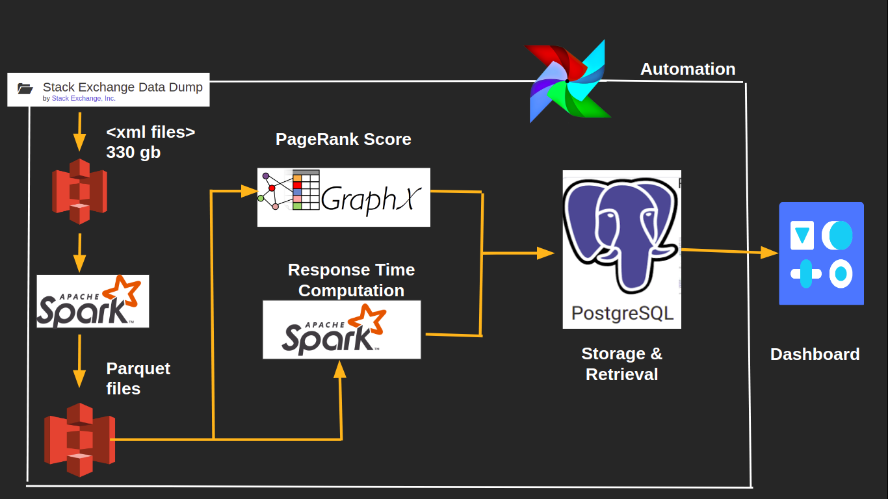
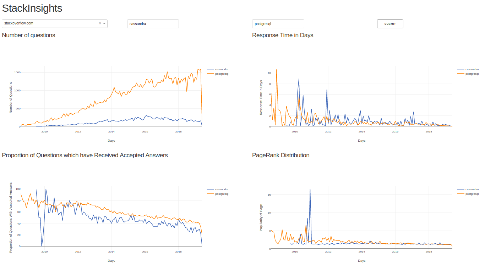

# stackInsight
Insight engineering project
## Motivation
The stackexchange network has over 170 QnA communites dedicated to answering questions about a variety of topics for people all over the world from different backgrounds. With so many questions being asked across different topics, it would certainly be interesting to see which topics have the most active users.
This would be useful in the following ways:
* Identify pages which topics have a low response time
* Place targeted ads on pages which have a high pagerank score in comparision to the rest of the pages.

## Pipeline

## DataSet
StackExchange data dump from the online internet archive [Link](https://archive.org/download/stackexchange) 

## Metrics
For a given online community and a set of tags entered by a user, the dashboard displays:
1. Total number of questions being asked over time.

2. The average response time of the answers to the questions over time.

3. The proportion of questions which have received an acceptable answer over time.

4. The page rank of the question pages and how it varies over time

## Data Engineering Takeaways:

1. XML files were to converted to parquet files.

2. Spark was used to calculate the response time based on the timestamps of the questions and answers.

3. Graphframes were used from the GraphFrame library to calculate pagerank on the pages and the corresponding links to identify the important pages based on the number of incoming links to the pages.

## Dashboard

