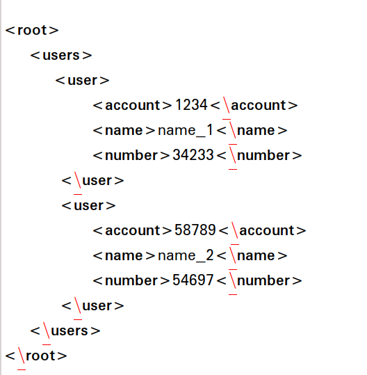
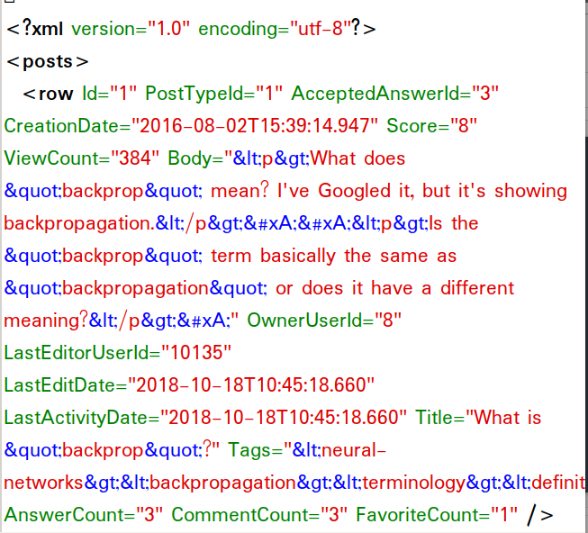

# stackInsight

Insight Data Engineering Fellowship Project New York 2019B Session

| ->  [Demo](https://www.datalit.info)        |                ->  [Slides](https://docs.google.com/presentation/d/1Vxph2p5KekOKe9e2O7LTa55-IDVIYwcrO0I3Z2CUGKI/edit?usp=sharing)           |
| ------------- |:-------------:|

## 1. Motivation
The stackexchange network has over 170 QnA communites dedicated to answering questions about a variety of topics for people all over the world from different backgrounds. With so many questions being asked across different topics, it would certainly be interesting to see which topics have the most active users.
This would be useful in the following ways:
* Identify active tags based on total number of questions, average response time, pagerank of links and percentage of answered questions.

* Place targeted ads on pages which have a high pagerank score in comparision to the rest of the pages.

* Compare different technologies and see how the metrics differ and set expectations on the basis of the metrics.

* Can be used by small startups which has launched a new product to monitor how their tech is performing in the community.

## 2. Pipeline

## 3. Requirements
- Python3
- [AWS CLI](https://aws.amazon.com/cli/)
- [boto3](https://boto3.amazonaws.com/v1/documentation/api/latest/guide/quickstart.html#installation)

## 4. Architechture

### Spark

4 EC2 m5ad.xlarge instances (1 master 3 slaves spark cluster)

[Installation](https://blog.insightdatascience.com/simply-install-spark-cluster-mode-341843a52b88)

### Airflow

1 EC2 m5ad.xlarge instance

[Installation](https://blog.insightdatascience.com/scheduling-spark-jobs-with-airflow-4c66f3144660)

### PostgreSQL

1 EC2 m5ad.xlarge instance

[Installation](https://blog.insightdatascience.com/simply-install-postgresql-58c1e4ebf252)

### Dash
1 EC2 m5ad.large instance

[Installation](https://dash.plot.ly/installation)

## 5. DataSet
StackExchange data dump from the online internet archive [Link](https://archive.org/download/stackexchange) 

## 6. Metrics
For a given online community and a set of tags entered by a user, the dashboard displays:
1. Total number of questions being asked over time.

2. The average response time(in Days) of the answers to the questions over time.

3. The proportion of questions which have received an acceptable answer over time.

4. The page rank of the question pages and how it varies over time

## 7. Methodology

### Data Collection:

_retrieve_urls.py_: Uses the BeautifulSoup package to parse the urls on the stackexchange data dump to retrieve the urls of the .7z files of all the stackExchange communities.

_transfer.sh_: Loads the .7z files of the stackexchange communities to the S3 bucket.

_s3_xml.py_: Extracts the xml files by attaching the community name to the files from the .7z compressed files and stores them on the S3 bucket.
For example, Posts.xml of the askubuntu community is stored as postsaskubuntu.com.xml on S3.

### Conversion To Parquet:

 
Datbricks Supported XML    | Databricks non-supported xml
:-------------------------:|:-------------------------:
  |  

In order to extract the attributes of the tags of the xml files , I converted the xml files to parquet due to the limitations of the DataBricks xml parser library which requires the attribute to be embedded between pairs of tags as opposed to all atrributes within a single pair of tags. 

This was done by reading the xml files as a text file where each line was read as a key value pair which was then fed to a user defined function. To this, I appended the community name associated with each file name and performed a join on the udfs.The output was then written as parquet files to S3.

### Calculation of PageRank Score

To quote Wikipedia:

PageRank works by counting the number and quality of links to a page to determine a rough estimate of how important the website is. The underlying assumption is that more important websites are likely to receive more links from other websites.

1. The links.parquet file is first read in as a dataframe. This dataframe is then partitioned on the basis of the community of the questions across the cluster. 
2. Using the Spark's graphX library, the links dataframe is converted to a graphframe. Here the total number of vertices are identified as the number of distinct question ids within the community. Two vertices share an edge if the link from the page of one question points to that of another question. This relationship between various vertices is represented as a graphFrame in spark.

`pr = graph_frame.pageRank(resetProbability=0.15, tol=0.01)`

3. The above command calculates the pagerank score of each node using the default parameters of resetProbability and tolerance.
The PageRank algorithm holds that an imaginary surfer who is randomly clicking on links will eventually stop clicking. The probability, at any step, that the person will continue is a damping factor. The damping factor can be be set by changing the resetProbability parameter. Here tol - the tolerance allowed at convergence (smaller => more accurate).

### Calculation of Response Time

### Dataframe Join and Output to PostgreSQL

## 8. Dashboard

